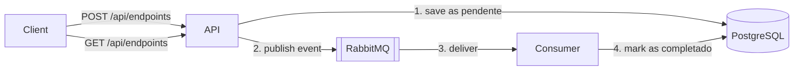

# Report Queue API


ASP.NET Core API that receives report requests, stores them in PostgreSQL and processes them asynchronously through RabbitMQ using MassTransit.

## How it works



1. `POST` saves the request with status `pendente` and publishes a `RelatorioSolicitadoEvent`.
2. The consumer receives the event, simulates the processing and updates the status to `completado`.
3. `GET` lists the requests, so you can watch the status change.

## Stack

ASP.NET Core (.NET 8), C#, EF Core, PostgreSQL, RabbitMQ, MassTransit, Docker, Docker Compose, GitHub Actions, xUnit, Moq.

## Running with Docker

Create a `.env` file in the repository root (see `.env.example`):

```
RABBIT_USER=rabbit_user
RABBIT_PASS=rabbit_pass
POSTGRES_USER=app_user
POSTGRES_PASS=app_pass
POSTGRES_DB=relatorios
```

Then start everything:

```
docker compose up --build
```

- Swagger: http://localhost:8080/swagger
- RabbitMQ management: http://localhost:15672

The database migration is applied automatically when the API starts.

## Endpoints

| Method | Route | Description |
|--------|-------|-------------|
| POST | `/api/endpoints?name={name}` | Creates a report request and publishes the event |
| GET | `/api/endpoints` | Lists all report requests |

## Tests

```
dotnet test test/RabbitTest/RabbitTest.csproj
```

- `RegisterReports` saves the request as `pendente`.
- `RegisterReports` publishes the expected event to the bus.
- `RelatorioConsumer` marks the request as `completado`.

Tests use an in-memory database and a mocked `IBus`, so they do not need Docker.

## CI

GitHub Actions runs on every push and pull request: it runs the tests and builds the Docker image.

## Project structure

```
src/RabbitIntegrationApi/
  Application/     use cases and dependency injection
  Bus/             MassTransit consumer
  Controllers/     HTTP endpoints
  Database/        EF Core DbContext
  Migrations/
test/RabbitTest/   unit tests
docker-compose.yml
```
