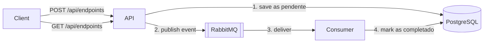

# Report Queue API


ASP.NET Core API that receives report requests, stores them in PostgreSQL and processes them asynchronously through RabbitMQ using MassTransit.

## How it works



1. `POST` saves the request with status `pendente` and publishes a `RelatorioSolicitadoEvent`.
2. The consumer receives the event, simulates the processing and updates the status to `completado`.
3. `GET` lists the requests, so you can watch the status change.

## Stack

ASP.NET Core (.NET 8), C#, EF Core, PostgreSQL, RabbitMQ, MassTransit, Docker, Docker Compose, GitHub Actions, xUnit, Moq.

## Running with Docker

Create a `.env` file in the repository root (see `.env.example`):

```
RABBIT_USER=rabbit_user
RABBIT_PASS=rabbit_pass
POSTGRES_USER=app_user
POSTGRES_PASS=app_pass
POSTGRES_DB=relatorios
```

Then start everything:

```
docker compose up --build
```

- Swagger: http://localhost:8080/swagger
- RabbitMQ management: http://localhost:15672

The database migration is applied automatically when the API starts.

## Endpoints

| Method | Route | Description |
|--------|-------|-------------|
| POST | `/api/endpoints?name={name}` | Creates a report request and publishes the event |
| GET | `/api/endpoints` | Lists all report requests |

## Tests

```
dotnet test test/RabbitTest/RabbitTest.csproj
```

- `RegisterReports` saves the request as `pendente`.
- `RegisterReports` publishes the expected event to the bus.
- `RelatorioConsumer` marks the request as `completado`.

Tests use an in-memory database and a mocked `IBus`, so they do not need Docker.

## CI

GitHub Actions runs on every push and pull request: it runs the tests and builds the Docker image.

## Project structure

```
src/RabbitIntegrationApi/
  Application/     use cases and dependency injection
  Bus/             MassTransit consumer
  Controllers/     HTTP endpoints
  Database/        EF Core DbContext
  Migrations/
test/RabbitTest/   unit tests
docker-compose.yml
```
# Running on AWS locally with Floci (ECR + ECS)

This guide runs the API as an ECS task on [Floci](https://github.com/floci-io/floci), a local AWS emulator. No AWS account is needed. The flow is the same as on real AWS: push the image to ECR, register a task definition, and run it on an ECS cluster.

It is written to be followed from scratch, on a machine that has never run the project. Commands are for Windows PowerShell.

## Contents

1. [Part A: machine setup (once per machine)](#part-a-machine-setup-once-per-machine)
2. [Part B: project setup (once per clone)](#part-b-project-setup-once-per-clone)
3. [Part C: deploy to the local ECS](#part-c-deploy-to-the-local-ecs)
4. [Starting over](#starting-over)
5. [Good to know](#good-to-know)
6. [Troubleshooting](#troubleshooting)

## Part A: machine setup (once per machine)

### A1. Install the tools

| Tool | How |
|------|-----|
| Docker Desktop (with WSL 2) | https://www.docker.com/products/docker-desktop |
| Git | `winget install Git.Git` |
| AWS CLI v2 | `winget install Amazon.AWSCLI --source winget` |

The .NET SDK is not required, because the image is built inside Docker.

**Close every PowerShell window and open a new one** after installing the AWS CLI. Otherwise `aws` is not found. Check:

```powershell
docker --version
aws --version
git --version
```

If `aws` is still not recognized, call it by its full path once (`& "C:\Program Files\Amazon\AWSCLIV2\aws.exe" --version`) and restart Windows to refresh the PATH.

### A2. Make the ECR address resolvable

Floci returns ECR addresses such as `000000000000.dkr.ecr.us-east-1.localhost:4566`. Windows does not resolve that name by itself, so `docker push` fails with `no such host`.

Open PowerShell **as administrator**:

```powershell
Add-Content C:\Windows\System32\drivers\etc\hosts "`n127.0.0.1 000000000000.dkr.ecr.us-east-1.localhost"
ipconfig /flushdns
ping 000000000000.dkr.ecr.us-east-1.localhost
```

The ping must answer from `127.0.0.1`.

### A3. Allow plain HTTP for this registry

In Docker Desktop, open Settings, Docker Engine, and add the key below to the JSON (keep the existing keys):

```json
"insecure-registries": ["000000000000.dkr.ecr.us-east-1.localhost:4566"]
```

Click Apply and restart, and wait until Docker is running again.

## Part B: project setup (once per clone)

### B1. Clone the repository

```powershell
git clone https://github.com/JoaoVitorResende/RabbitIntegration.git
cd RabbitIntegration
```

### B2. Create the `.env` file

The `.env` file is ignored by Git. Create it from the example:

```powershell
Copy-Item .env.example .env
```

`.env.example` contains:

```
RABBIT_USER=rabbit_user
RABBIT_PASS=rabbit_pass
POSTGRES_USER=app_user
POSTGRES_PASS=app_pass
POSTGRES_DB=relatorios
```

Do not use `pg_user` or any name starting with `pg_` for the PostgreSQL user: that prefix is reserved and the database refuses to start.

### B3. Check the compose file

`docker-compose.yml` must have these two points, otherwise the ECS task cannot reach the database and the broker:

1. A fixed project name on the first line. The Docker network used by the tasks is named after it (`rabbitintegration_default`). Without a fixed name, cloning into a folder with another name breaks the network.

   ```yaml
   name: rabbitintegration
   ```

2. The Floci service, with the network name, the Docker socket (needed to start the task containers) and the port bound to localhost:

   ```yaml
   floci:
     image: floci/floci:latest
     ports:
       - "127.0.0.1:4566:4566"
     environment:
       FLOCI_HOSTNAME: floci
       FLOCI_SERVICES_ECS_DOCKER_NETWORK: rabbitintegration_default
     volumes:
       - /var/run/docker.sock:/var/run/docker.sock
   ```

To make the setup reproducible over time, pin the image to the version you tested instead of `latest`:

```powershell
docker pull floci/floci:latest
docker image inspect floci/floci:latest --format "{{index .RepoDigests 0}}"
```

Use the printed value (`floci/floci@sha256:...`) in the `image:` line.

The `api` service has `profiles: ["local"]`, so it only starts with `docker compose --profile local up`. This avoids a port 8080 conflict with the ECS task.

### B4. Check that the API applies migrations

`Program.cs` must run the migration at startup, right after `builder.Build()`. Without it the API starts with an empty database.

```csharp
using (var scope = app.Services.CreateScope())
{
    var db = scope.ServiceProvider.GetRequiredService<AppDbContext>();
    db.Database.Migrate();
}
```

## Part C: deploy to the local ECS

### C1. Start the infrastructure

```powershell
docker compose up -d
docker ps
```

`postgres`, `rabbitmq`, `floci` and, after the first repository is created, `floci-ecr-registry` must be running. If a local `api` container exists from a previous run, stop it:

```powershell
docker stop rabbitintegration-api-1
```

### C2. Point the AWS CLI to Floci

These variables only live in the current PowerShell window. Repeat them in every new window.

```powershell
$env:AWS_ENDPOINT_URL="http://localhost:4566"
$env:AWS_ACCESS_KEY_ID="test"
$env:AWS_SECRET_ACCESS_KEY="test"
$env:AWS_DEFAULT_REGION="us-east-1"
```

The credentials are fake. Floci does not validate them. Check that the emulator answers:

```powershell
aws s3 mb s3://teste
aws s3 ls
```

### C3. Create the ECR repository

If the repository does not exist yet:

```powershell
$repo = aws ecr create-repository `
  --repository-name report-queue-api `
  --query repository.repositoryUri `
  --output text

$repo

$repo = aws ecr describe-repositories `
  --repository-names report-queue-api `
  --query "repositories[0].repositoryUri" `
  --output text

$repo

000000000000.dkr.ecr.us-east-1.localhost:4566/report-queue-api
```


### C4. Build and push the image

```powershell
docker build -t "${repo}:latest" ./src/RabbitIntegrationApi
docker push "${repo}:latest"
aws ecr list-images --repository-name report-queue-api
```

The last command should list the `latest` tag.

### C5. Register the task definition

Use the same values as in your `.env`. The generated `task-def.json` contains passwords and is ignored by Git.

```powershell
@"
{
  "family": "report-queue-api",
  "containerDefinitions": [{
    "name": "api",
    "image": "${repo}:latest",
    "portMappings": [{ "containerPort": 8080, "hostPort": 8080 }],
    "environment": [
      { "name": "ASPNETCORE_ENVIRONMENT", "value": "Development" },
      { "name": "RabbitMQ__Host", "value": "amqp://rabbitmq:5672" },
      { "name": "RabbitMQ__Username", "value": "rabbit_user" },
      { "name": "RabbitMQ__Password", "value": "rabbit_pass" },
      { "name": "ConnectionStrings__DefaultConnection",
        "value": "Host=postgres;Port=5432;Database=relatorios;Username=app_user;Password=app_pass" }
    ]
  }]
}
"@ | Set-Content task-def.json -Encoding ascii

aws ecs register-task-definition --cli-input-json file://task-def.json
```

Inside the task, `postgres` and `rabbitmq` resolve by service name because Floci runs the task on the compose network.

### C6. Create the cluster and run the task

```powershell
aws ecs create-cluster --cluster-name report-cluster
aws ecs run-task --cluster report-cluster --task-definition report-queue-api
```

### C7. Verify

```powershell
docker ps
```

A new container named `floci-ecs-...-api` should appear. Open `http://localhost:8080/swagger`, create a report, and check that its status changes from `pendente` to `completado`.

### C8. Stop the task

```powershell
$task = aws ecs list-tasks --cluster report-cluster --query "taskArns[0]" --output text
aws ecs stop-task --cluster report-cluster --task $task
```

## Starting over

To go back to a clean state (containers, database volume and Floci state), run:

```powershell
docker compose down -v
docker rm -f floci-ecr-registry
docker ps -aq --filter "name=floci-ecs" | ForEach-Object { docker rm -f $_ }
```

Then repeat Part C. The `hosts` entry and the `insecure-registries` setting (Part A) are kept, and the `.env` file (Part B) too.

## Good to know

- **Floci keeps its state in memory.** If the Floci container is recreated or restarted, the repository, task definition and cluster are lost. Repeat C3 to C6.
- **Port exposure.** The compose file binds Floci, RabbitMQ and the local API to `127.0.0.1`. The ECS task container is created by Floci and may be published on all interfaces (`0.0.0.0:8080`). Stop the task when you are not testing.
- **Docker socket.** Mounting `/var/run/docker.sock` lets Floci control your Docker. Use it only on your own machine.
- **Differences from real AWS.** On real AWS the task would use Fargate with `awsvpc` networking, an execution role, and secrets from Secrets Manager or SSM instead of plain environment variables. PostgreSQL would be RDS. An emulator does not guarantee identical behavior to AWS.

## Troubleshooting

| Problem | Likely cause and fix |
|---------|----------------------|
| `aws` is not recognized | Open a new PowerShell window after installing, or restart Windows. |
| `no such host` on `docker push` | The `hosts` entry is missing. Repeat A2 as administrator and restart Docker Desktop. |
| `RepositoryNotFoundException` | Floci was recreated. Repeat C3 to C6. |
| Push asks for authentication | Run `aws ecr get-login-password \| docker login --username AWS --password-stdin http://000000000000.dkr.ecr.us-east-1.localhost:4566` and push again. |
| PostgreSQL container does not start | Check the user name in `.env` (it cannot start with `pg_`). If the volume was created with other values, run `docker compose down -v` and start again. |
| The task cannot reach `postgres` or `rabbitmq` | The Docker network name in `FLOCI_SERVICES_ECS_DOCKER_NETWORK` does not match the compose project name. Check B3. |
| Port 8080 already in use | Stop the local `api` container or the previous task. |
| The task does not start | Run `aws ecs list-tasks --cluster report-cluster --desired-status STOPPED`, then `aws ecs describe-tasks` with that ARN and read `stoppedReason`. Also check `docker logs` of the task container. |